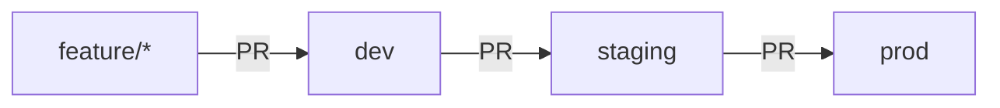

# CodeFast SaaS: Cloud Build Log #1

> Taking a full-stack SaaS app from "runs on my laptop" to a containerized,
> CI/CD-deployed service on AWS, built step by step and documented as I go.

## About This Project

This is part of my **Cloud Build Log**, a series where I take an application
through the full DevOps lifecycle by hand. I write every file and run every
command myself, and I document the decisions I made and the problems I hit
along the way.

The app is a feedback board where users post ideas and vote on them
(Next.js, MongoDB, Auth.js, Stripe). It started as a course project; the
containerization, pipelines, and infrastructure are my own work.

## What This Project Demonstrates

- **Containerization:** multi-stage Docker build (1.06 GB → 336 MB), non-root user, health checks
- **Environment promotion:** dev → staging → prod, with every change going through a PR
- **Runtime configuration:** one image, configured per environment, with no secrets baked in
- **CI/CD:** *(Phase 2–4)*
- **Infrastructure as code:** *(Phase 3)*
- **Debugging:** real problems I hit, and how I diagnosed and fixed them ([see below](#problems-i-solved))

## Project Roadmap

- [x] **Phase 1:** Containerization with Docker and Docker Compose
- [ ] **Phase 2:** CI with GitHub Actions (lint, test, build, image scan)
- [ ] **Phase 3:** AWS infrastructure with Terraform
- [ ] **Phase 4:** Continuous deployment (dev → staging → prod)
- [ ] **Phase 5:** Monitoring and alerting

## How to Read This Repo

Each phase is a pull request into `dev`, made of small, single-purpose
commits. The PRs are the best place to see how the project developed:

- Phase 1: Containerization → *(link to PR)*

## Tech Stack

| Layer | Tools |
|---|---|
| App | Next.js 15, React 19, MongoDB (Mongoose), Auth.js, Stripe |
| Containers | Docker (multi-stage), Docker Compose |
| CI/CD | GitHub Actions *(Phase 2)* |
| Cloud | AWS, Terraform *(Phase 3)* |

## Branching Strategy



- New work happens on a short-lived `feature/*` branch.
- Features merge into `dev` through a pull request.
- Changes are promoted `dev` → `staging` → `prod`, each through its own PR.
- Each branch maps to its own environment.

**Why I chose this:** environment branches make it easy to see what is
running where. The `prod` branch *is* production. The tradeoff is that each
branch builds its own image, so staging and prod aren't guaranteed to run the
exact same artifact. The alternative is trunk-based development: one `main`
branch, where the pipeline builds the image once and promotes that same image
through each environment. I plan to use that model in a later Build Log
project to compare the two.

## Run It Locally

**Prerequisites:** [Docker Desktop](https://www.docker.com/products/docker-desktop/),
[Stripe CLI](https://docs.stripe.com/stripe-cli), a Stripe account in test
mode, and Google OAuth credentials.

1. Clone the repo:
   ```bash
   git clone https://github.com/keshawndev/code-fast-saas.git
   cd code-fast-saas
   ```
2. Copy the example env file and fill in your values:
   ```bash
   cp .env.example .env.local
   ```
   Docker Compose sets `MONGO_URI`, `AUTH_URL`, and `AUTH_TRUST_HOST` for you.
3. Start the app and a local MongoDB:
   ```bash
   docker compose up --build
   ```
4. In a second terminal, forward Stripe webhooks to the container:
   ```bash
   stripe listen --forward-to localhost:3000/api/webhook
   ```
   Put the `whsec_...` secret it prints into `STRIPE_WEBHOOK_SECRET` in
   `.env.local`, then restart the app with
   `docker compose up -d --force-recreate app`.
5. Open http://localhost:3000. To test a subscription, use Stripe's test card
   `4242 4242 4242 4242` with any future expiration date and any CVC.

Stop everything with `docker compose down`. Add `-v` to also delete the
local database.

## Phase 1: Containerization

| | Before | After |
|---|---|---|
| Runtime files | 439 MB (`node_modules`) | 66 MB (Next.js standalone output) |
| Docker image | 1.06 GB (build stage) | 336 MB (final image) |

- **Multi-stage build:** separate stages install dependencies, build the
  app, and run it. Only the final stage ships, so build tools never reach
  production.
- **Layer caching:** `package.json` is copied before the source code, so
  dependencies are only reinstalled when they change. Rebuilds went from
  85s to about 1s.
- **Non-root user:** the container runs as a limited `nextjs` user instead
  of root.
- **Health checks:** a `/api/health` endpoint, checked by Docker's
  `HEALTHCHECK` and later by the AWS load balancer.
- **Build once, configure at runtime:** secrets are passed in when the
  container starts, never baked into the image. `.dockerignore` keeps
  `.env` files out of the build.
- **One-command setup:** Docker Compose runs the app with a local MongoDB,
  a persistent volume, and health-based startup ordering.
- **Consistent line endings:** `.gitattributes` enforces LF endings, so
  files edited on Windows don't break in Linux containers.

### Problems I Solved

**1. The build failed without database credentials**
- **Problem:** `next build` crashed inside Docker with `Missing environment variable: "MONGO_URI"`.
- **Cause:** `libs/mongo.js` connected to MongoDB as soon as it was imported, and Next.js imports route files during the build.
- **Fix:** made the connection lazy. It now connects on first use, so the database is only needed at runtime.

**2. The container reported "unhealthy" even though the app worked**
- **Problem:** the site loaded in a browser, but `docker ps` showed `(unhealthy)`.
- **Cause:** I found it with `docker inspect` and by testing from inside the container. On Alpine, `localhost` resolved to IPv6 (`::1`), but the server only listened on IPv4.
- **Fix:** pointed the health check at `127.0.0.1`.

**3. Google sign-in failed inside the container**
- **Problem:** OAuth login was rejected.
- **Cause:** `/api/auth/providers` showed Auth.js building callback URLs with `0.0.0.0` (the server's listen address) instead of `localhost`, so they didn't match the URIs registered with Google.
- **Fix:** set `AUTH_URL` to tell Auth.js its public address. Each environment gets its own value.

**4. Subscriptions didn't activate**
- **Problem:** checkout succeeded, but the user never got access.
- **Cause:** Stripe confirms payments by calling the app's webhook, and Stripe's servers can't reach `localhost`.
- **Fix:** used the Stripe CLI to forward webhook events to the local container.

## Known Issues

- The board share link is hardcoded to a single domain. It needs to come
  from per-environment configuration.
- `/dashboard` can throw on a null session in one case.
- A few ESLint warnings remain; these will be fixed once CI enforces linting
  in Phase 2.
