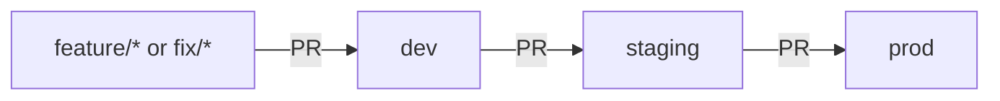

# CodeFast SaaS: Cloud Build Log #1

> Taking a full-stack SaaS app from "runs on my laptop" to a containerized,
> CI/CD-deployed service on AWS, built step by step and documented as I go.

## About This Project

This is part of my **Cloud Build Log**, a series where I take an application
through the full DevOps lifecycle by hand. I write every file and run every
command myself, and I document the decisions I made and the problems I hit
along the way.

The app is a feedback board where users post ideas and vote on them
(Next.js, MongoDB, Auth.js, Stripe). It started as a course project; the
containerization, pipelines, and infrastructure are my own work.

## What This Project Demonstrates

- **Containerization:** multi-stage Docker build (1.06 GB → 336 MB), non-root user, health checks
- **Environment promotion:** dev → staging → prod, with every change going through a PR
- **Runtime configuration:** one image, configured per environment, with no secrets baked in
- **CI/CD:** *(Phase 2–4)*
- **Infrastructure as code:** *(Phase 3)*
- **Debugging:** real problems I hit, and how I diagnosed and fixed them (see each phase's write-up)

## Project Phases

Each phase has its own write-up covering the design decisions and the
problems I solved, plus a pull request into `dev` with the actual changes.

| Phase | Status | Write-up |
|---|---|---|
| 1. Containerization with Docker and Docker Compose | ✅ Done | [docs/phase-1-containerization.md](docs/phase-1-containerization.md) |
| 2. CI with GitHub Actions (lint, test, build, image scan) | Planned | |
| 3. AWS infrastructure with Terraform | Planned | |
| 4. Continuous deployment (dev → staging → prod) | Planned | |
| 5. Monitoring and alerting | Planned | |

## Tech Stack

| Layer | Tools |
|---|---|
| App | Next.js 15, React 19, MongoDB (Mongoose), Auth.js, Stripe |
| Containers | Docker (multi-stage), Docker Compose |
| CI/CD | GitHub Actions *(Phase 2)* |
| Cloud | AWS, Terraform *(Phase 3)* |

## Branching Strategy



- New work happens on a short-lived `feature/*` or `fix/*` branch.
- Changes merge into `dev` through a pull request.
- Changes are promoted `dev` → `staging` → `prod`, each through its own PR.
- Each branch maps to its own environment.

**Why I chose this:** environment branches make it easy to see what is
running where. The `prod` branch *is* production. The tradeoff is that each
branch builds its own image, so staging and prod aren't guaranteed to run the
exact same artifact. The alternative is trunk-based development: one `main`
branch, where the pipeline builds the image once and promotes that same image
through each environment. I plan to use that model in a later Build Log
project to compare the two.

## Run It Locally

**Prerequisites:** [Docker Desktop](https://www.docker.com/products/docker-desktop/),
[Stripe CLI](https://docs.stripe.com/stripe-cli), a Stripe account in test
mode, and Google OAuth credentials.

1. Clone the repo:
   ```bash
   git clone https://github.com/keshawndev/code-fast-saas.git
   cd code-fast-saas
   ```
2. Copy the example env file and fill in your values:
   ```bash
   cp .env.example .env.local
   ```
   Docker Compose sets `MONGO_URI`, `AUTH_URL`, and `AUTH_TRUST_HOST` for you.
3. Start the app and a local MongoDB:
   ```bash
   docker compose up --build
   ```
4. In a second terminal, forward Stripe webhooks to the container:
   ```bash
   stripe listen --forward-to localhost:3000/api/webhook
   ```
   Put the `whsec_...` secret it prints into `STRIPE_WEBHOOK_SECRET` in
   `.env.local`, then restart the app with
   `docker compose up -d --force-recreate app`.
5. Open http://localhost:3000. To test a subscription, use Stripe's test card
   `4242 4242 4242 4242` with any future expiration date and any CVC.

Stop everything with `docker compose down`. Add `-v` to also delete the
local database.

## Known Issues

- Board share link is hardcoded to a single domain. *(fix in progress)*
- `/dashboard` can throw on a null session in one case. *(fix in progress)*
- A few ESLint warnings remain; these will be fixed once CI enforces linting
  in Phase 2.
