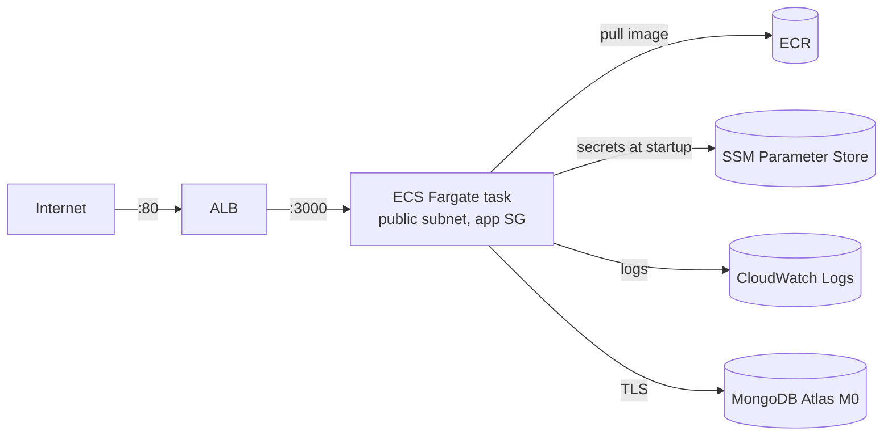

# Phase 3: AWS Infrastructure with Terraform

**Goal:** Terraform builds a running dev environment on AWS. The app is
reachable at a public URL, and the whole environment can be destroyed and
rebuilt with one command.

**Status:** in progress. The bootstrap stack is merged
([#21](https://github.com/keshawndev/code-fast-saas/pull/21)). The dev
stack (network, security groups, IAM, ECS, load balancer) is on
`feature/phase-3-dev-backend`, and the app answers through the ALB over
HTTP. HTTPS and end-to-end checks are next.

## Architecture

Terraform is split into two stacks with separate state:

| Stack     | Folder             | State                                             | Lifecycle                                 | Contents                                                                 |
| --------- | ------------------ | ------------------------------------------------- | ----------------------------------------- | ------------------------------------------------------------------------ |
| Bootstrap | `infra/bootstrap/` | Local file (gitignored)                           | Long-lived                                | Budget alarm, S3 state bucket, ECR repository                            |
| Dev       | `infra/envs/dev/`  | `s3://…/dev/terraform.tfstate`, native S3 locking | **Destroyed at the end of every session** | VPC, subnets, security groups, IAM roles, ECS cluster/service, log group, ALB |

## Results (so far)

|                               | Before                                     | After                                                                                                     |
| ----------------------------- | ------------------------------------------ | --------------------------------------------------------------------------------------------------------- |
| AWS credentials on my machine | 1 long-lived IAM access key (8 months old) | None. IAM Identity Center SSO, short-lived role credentials                                               |
| Cost guardrail                | 2 console-made budgets (one a duplicate)   | 1 Terraform-managed $10/month budget (80% actual, 100% forecast alerts)                                   |
| Terraform state               | n/a                                        | Versioned, encrypted S3 bucket with public access blocked and `prevent_destroy` (tested)                  |
| Image in a registry           | Local only                                 | ECR, tagged with the git SHA, immutable tags, scan on push (0 findings)                                   |
| Image size in the registry    | 336 MB locally (uncompressed)              | 80 MB in ECR (compressed layers)                                                                          |
| Secrets for the deployed app  | `.env.local` on my laptop                  | 7 SSM `SecureString` parameters, injected at container start, never in git, the image, or Terraform state |
| Dev environment               | n/a                                        | One `terraform apply` creates it and one `terraform destroy` removes it                                   |
| App on AWS                    | n/a                                        | Fargate task running, Next.js `Ready in 810ms` in CloudWatch Logs                                         |
| Public endpoint               | n/a                                        | ALB DNS name, `/api/health` returns `200 OK` through the load balancer                                   |

## What I Built

| File                                                                        | Purpose                                                                            |
| --------------------------------------------------------------------------- | ---------------------------------------------------------------------------------- |
| [`infra/bootstrap/versions.tf`](../infra/bootstrap/versions.tf)             | Terraform >= 1.10, AWS provider `~> 6.0`, `default_tags`                           |
| [`infra/bootstrap/budget.tf`](../infra/bootstrap/budget.tf)                 | $10/month cost budget with email alerts (`budget_email` is a `sensitive` variable) |
| [`infra/bootstrap/state_bucket.tf`](../infra/bootstrap/state_bucket.tf)     | Remote state bucket: versioning, SSE-S3, public access block, `prevent_destroy`    |
| [`infra/bootstrap/ecr.tf`](../infra/bootstrap/ecr.tf)                       | Shared ECR repository: immutable tags, scan on push, keep the last 10 images       |
| [`infra/envs/dev/versions.tf`](../infra/envs/dev/versions.tf)               | S3 backend with `use_lockfile = true`, `default_tags` with `Stack = "dev"`         |
| [`infra/envs/dev/network.tf`](../infra/envs/dev/network.tf)                 | VPC `10.0.0.0/16`, two public subnets in two AZs, internet gateway, route table    |
| [`infra/envs/dev/security_groups.tf`](../infra/envs/dev/security_groups.tf) | ALB SG (HTTP from the internet) and app SG (only from the ALB SG)                  |
| [`infra/envs/dev/iam.tf`](../infra/envs/dev/iam.tf)                         | ECS execution role (ECR, logs, SSM secrets) and an empty task role                 |
| [`infra/envs/dev/ecs.tf`](../infra/envs/dev/ecs.tf)                         | Cluster, log group (7-day retention), Fargate task definition, service             |
| [`infra/envs/dev/alb.tf`](../infra/envs/dev/alb.tf)                         | ALB, target group (`ip` targets, health check on `/api/health`), HTTP listener     |
| [`infra/envs/dev/outputs.tf`](../infra/envs/dev/outputs.tf)                 | `app_url` output, used by scripts and `curl`                                       |
| `terraform.tfvars.example` (both stacks)                                    | Documents required inputs. Real `terraform.tfvars` files are gitignored            |

## Design Decisions

- **Budget before anything that bills.** The $10 budget was the first
  resource applied. A forecast alert at 100% warns before the money is
  spent, not after.
- **A bootstrap stack for the state bucket.** The bucket has to exist
  before any stack can store state in it, so the stack that creates it
  keeps its own state locally. It's small, rarely changes, and costs
  almost nothing, so it stays up.
- **Separate state per environment.** Dev has its own folder and state key.
  `terraform destroy` in dev can't touch the bootstrap stack, and later
  staging and prod can't be affected by dev.
- **Native S3 locking instead of DynamoDB.** Terraform 1.10+ writes a
  `.tflock` object next to the state, so concurrent applies are blocked
  without a separate lock table.
- **ECR lives in bootstrap, not dev.** Dev is destroyed every session. A
  registry in dev would delete the images every time. In practice the
  registry is shared infrastructure that every environment pulls from.
- **Immutable, SHA-based image tags.** A tag like `2945516` always means
  the same image and traces back to one commit. `:latest` says nothing
  about what's running.
- **Public subnets, no NAT gateway.** A NAT gateway costs about $32/month
  even when idle. Tasks get public IPs instead, and security groups keep
  them reachable only from the load balancer. Production would normally use
  private subnets plus NAT.
- **Security group chaining.** The app SG allows ingress only from the ALB's
  security group (not from an IP range), so the app can't be reached
  directly from the internet.
- **Explicit egress rules.** Terraform removes AWS's default allow-all
  egress, so outbound access (ECR, Atlas, Google, Stripe) is written out.
- **Secrets in SSM Parameter Store, set outside Terraform.** Values are put
  in with the CLI from a no-echo prompt. Terraform only references the
  parameter names, so no secret value ever enters Terraform state or shell
  history. Standard SSM parameters are free. Secrets Manager adds rotation
  but costs $0.40 per secret per month, which isn't worth it for dev.
- **Execution role vs task role.** The execution role pulls the image,
  writes logs, and reads the SSM secrets. The task role is empty, because
  the app doesn't call AWS APIs itself (least privilege).
- **Atlas network access is `0.0.0.0/0`.** Fargate tasks get a new public
  IP on every start, so there's no fixed IP to allow-list. Strong
  credentials, TLS, and a dedicated dev user limit the risk. The production
  fix would be NAT with a static Elastic IP, or PrivateLink on a paid tier.
- **Explicit security settings even where AWS has defaults.** S3 now
  encrypts and blocks public access by default, but writing it out makes
  the intent reviewable and passes policy scanners.
- **Tags on everything.** `default_tags` adds `Project`, `ManagedBy`, and
  `Stack` to every resource, for cost filtering and cleanup.

## Problems I Solved

### 1. Replacing a long-lived access key without locking myself out

- **Problem:** the AWS CLI used an 8-month-old access key on an IAM user with full admin rights.
- **Cause:** that's how the account was first set up. Long-lived keys don't expire, so a leaked config file would mean a permanent leaked credential.
- **Fix:** set up IAM Identity Center with an SSO profile and confirmed it worked first. Then I checked the key's last-used data, deactivated it (reversible), and verified the old credentials failed before deleting the key and `~/.aws/credentials`. The first check after deactivating **still succeeded**. IAM changes take a few seconds to propagate, and a retry returned `InvalidClientTokenId`.

### 2. Two budgets that Terraform didn't know about

- **Problem:** after applying the Terraform budget, a CLI check listed three budgets.
- **Cause:** two budgets had been created earlier in the console, and one duplicated the new $10 budget. Terraform only manages what's in its state.
- **Fix:** deleted both console budgets with the CLI, so Terraform is the single source of truth.

### 3. `Variables may not be used here` in the backend block

- **Problem:** `terraform init` failed on `region = var.region` inside `backend "s3"`. (This was a deliberately broken instruction in my guided exercises.)
- **Cause:** Terraform configures the backend first, before it evaluates variables, because it needs the backend to read state.
- **Fix:** used a literal region in the backend. For multiple environments, the standard approach is partial configuration with `terraform init -backend-config=...`.

### 4. Dev resources tagged as `bootstrap`

- **Problem:** the plan for the dev network showed `"Stack" = "bootstrap"` on every resource.
- **Cause:** I copied the bootstrap provider block into the dev stack and only added the backend.
- **Fix:** changed the dev tag to `Stack = "dev"`. The plan showed 5 in-place updates (route table associations don't support tags), with no replacements.

### 5. An app security group with no outbound access

- **Problem:** during review, the app security group had only 3 of its 4 rules. The egress rule was missing.
- **Cause:** I left out the last resource when writing the file. Because Terraform strips the default egress rule, the app SG allowed no outbound traffic at all.
- **Fix:** added the egress rule before any task ran. Without it, ECS couldn't have pulled the image or reached the database, and the error (`CannotPullContainerError ... i/o timeout`) wouldn't have mentioned security groups.

### 6. "Scan does not exist" for an image that was scanned

- **Problem:** `describe-image-scan-findings` by tag returned `ScanNotFoundException`, and ECR listed three entries for one push.
- **Cause:** Docker pushed an OCI image **index** that points to the app image and a provenance attestation. The tag points to the index, but ECR scans the actual image.
- **Fix:** looked up the scan by the child image's digest: `COMPLETE`, 0 findings. My AI mentor did this investigation. I learned to check what a tag points to (`imageManifestMediaType`).

### 7. Terraform stopped and asked for a variable

- **Problem:** `terraform plan` prompted for `var.image_tag`.
- **Cause:** `terraform.tfvars` existed but was 0 bytes. The values had never been saved into it.
- **Fix:** filled in and saved the file. In CI, the same situation should fail fast with `-input=false` instead of hanging on a prompt.

### 8. The Fargate task couldn't read its secrets

- **Problem:** the service never ran a task: `ResourceInitializationError: unable to pull secrets ... AccessDeniedException: User: ...assumed-role/code-fast-saas-dev-execution/... is not authorized to perform: ssm:GetParameters`. (Also a planned drill.)
- **Cause:** I had attached `ssm:GetParameters` to the **task** role. Secrets listed in a task definition are fetched by the **execution** role, before the container starts. The error message named the role that was missing the permission.
- **Fix:** moved the policy to the execution role and left the task role empty. Along the way:
  - My first attempt (`role = task.id && execution.id`) passed `terraform validate` but wasn't valid, because `&&` needs booleans and an inline policy belongs to exactly one role.
  - After the fix, the service still showed AccessDenied. The timestamps showed those events were from before the fix, and ECS was backing off between retries. `aws ecs update-service --force-new-deployment` started a fresh task, and the logs showed Next.js `Ready in 810ms`.

### 9. Running `destroy` in the wrong stack

- **Problem:** at the end of a session, a `cd` failed, and I ran `terraform destroy` in `infra/bootstrap` instead of `infra/envs/dev`.
- **Cause:** a relative path that didn't exist from my current directory. The commands after it still ran.
- **Fix:** nothing was deleted. `prevent_destroy` on the state bucket blocked the whole plan, including the budget and ECR. Now I run `pwd` before every `destroy`, and only the dev stack is part of the end-of-session teardown.

### 10. 504 Gateway Timeout from the load balancer

- **Problem:** after adding the ALB, the app URL returned `504 Gateway Timeout`. (A planned drill.)
- **Cause:** the target group sent traffic to the task on port 3000, where Next.js listens, but the app security group only allowed port 80 from the ALB. The security group silently dropped the packets, so the ALB timed out. The listener port (80, what browsers use) and the target port (3000, what the ALB uses to reach the task) are separate settings, and I had mixed them up in the security group.
- **Fix:** changed the `app_from_alb` ingress rule to 3000. My first idea was to change the target group to 80, but the container logs (`Network: ...:3000`) showed nothing listens on 80, so that would have traded one failure for another.
- **After the fix:** the response changed to `503`. ECS had already killed the unhealthy task, and the old target was **draining** for the default 300-second deregistration delay, so for a few minutes there was no healthy target at all. Once the replacement task passed two health checks, `/api/health` returned `200 OK`.

## What I Learned

- **Read the plan's summary line first**, and predict it before running
  `plan`. A mismatch is the cue to stop. `-/+` (replace) and `-` (destroy)
  get a closer look than `+` and `~`.
- `terraform validate` checks structure, not every value. `plan` is the
  real test.
- `sensitive = true` hides a value in plan output, but it's still stored in
  plain text in the state file. That's why state is encrypted and private.
- Dependencies come from references. Terraform creates the bucket before
  its settings, runs independent resources in parallel, and destroys in
  reverse order, all without any ordering logic from me.
- The backend is configured before anything else, so it only accepts
  literal values.
- Separate state per environment limits the blast radius of mistakes,
  including my own.
- `prevent_destroy` blocks an entire plan, not just one resource. It
  doesn't protect against console deletions or someone removing the block,
  so it's one layer of protection, not the only one.
- Console-created resources ("ClickOps") are invisible to Terraform. A
  quick CLI audit after an apply catches duplicates and drift.
- IAM is eventually consistent. A check right after a change can show the
  old state, so wait and retry before changing the config.
- ECS has two roles that are easy to mix up: the execution role starts the
  container (image, logs, secrets) and the task role is what the app's own
  code uses.
- When a fix "doesn't work," check that the evidence is newer than the fix.
  Events and logs on screen can be stale.
- `apply` finishing doesn't mean the app is running. ECS accepts the
  service, then starts tasks in the background, so check
  `describe-services` and the logs.
- An image tag can point to an index rather than an image. Checking what a
  reference actually points to explains a lot of "not found" errors.
- Long pasted commands can wrap and split into two commands. `command not
found` for something that is obviously an argument is the giveaway.
  Shell variables and shorter commands avoid it.
- Short-lived SSO credentials expire by design. `aws sso login` at the
  start of a session is the tradeoff for not having a permanent key.
- Load balancer status codes say where the break is: 503 means no healthy
  targets, 504 means a target exists but didn't answer in time (often a
  security group dropping traffic), and 502 means it answered badly.
- Trace a request hop by hop and check the port and the rule at each one.
- A service that fails health checks gets replaced automatically, so the
  status code can change while I'm still debugging. Check timestamps.
- `depends_on` is for ordering Terraform can't see: the ECS service needs
  the listener to exist, but nothing in the service references it.
- A failed `$(...)` substitution doesn't stop the outer command. It runs
  with an empty value (`curl: No host part in the URL`). Run the inner
  command alone first.

## Still To Do

- HTTPS with an ACM certificate and a subdomain (Google OAuth requires
  `https://` redirect URIs)
- `APP_URL` / `AUTH_URL` switched to the HTTPS URL
- End-to-end check: sign in, create a board, Stripe test checkout and
  webhook
- Final teardown check, README update, and promotion PRs

## Help and Sources

I wrote the Terraform and ran the commands myself, working step by step
with an AI mentor (Claude). Some steps were deliberately broken as debugging
drills (noted above). The mentor wrote `budget.tf`, `variables.tf`,
`outputs.tf`, and `terraform.tfvars.example` in the bootstrap stack at my
request, did the ECR scan investigation, and wrote this document from my
session notes. I took a Terraform course earlier, and the patterns here
(remote state, bootstrap stacks, security group chaining) are standard
practice rather than original designs.
